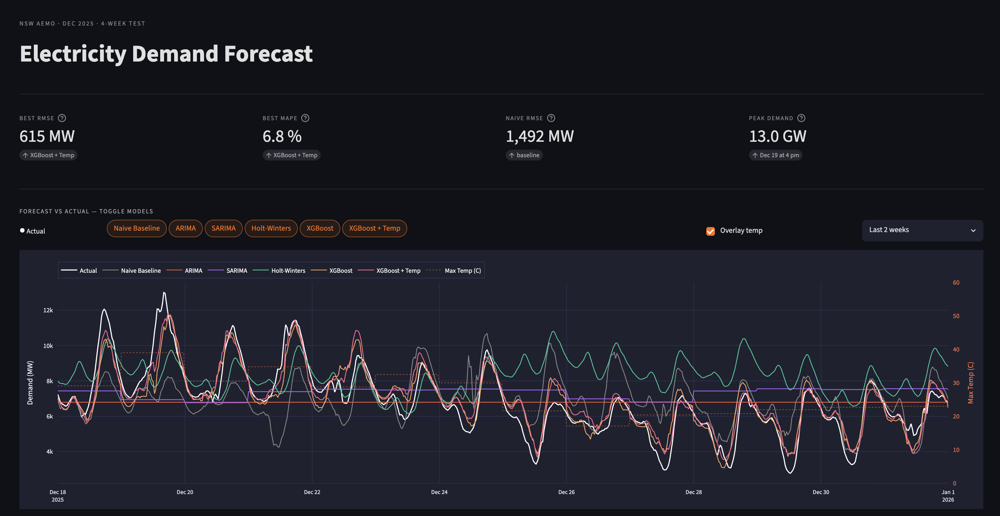

# NSW Electricity Demand Forecasting

Six forecasting models evaluated on seven years of AEMO NSW grid demand data (2019-2025). Best result: XGBoost with weather data at 6.8% MAPE on a held-out December 2025 test set - a 58% improvement over a naive seasonal baseline. Includes an interactive Streamlit dashboard and a full analysis report.

---

## Interactive Dashboard



An interactive Streamlit dashboard visualises the full test-period results:

- **KPI cards** - best RMSE, best MAPE, naive baseline RMSE, and peak demand event at a glance
- **Coloured pill toggles** - show or hide individual model forecast lines inline above the chart; each pill matches its chart line colour
- **Plotly forecast chart** - actual demand vs selected models with hover tooltips and native zoom/pan; optional temperature overlay on a secondary axis
- **Performance table** - RMSE and MAPE rendered as progress bars, sorted by RMSE
- **Key findings** - public holiday failure, daily-model granularity artefact, temperature contribution

```bash
streamlit run app.py
```

Requires `outputs/forecasts.csv` and `outputs/metrics.csv` - generated by running the notebook.

---

## Results

Test set: 4 December 2025 - 1 January 2026 (1,344 half-hour intervals)

| Model | RMSE (MW) | MAPE (%) | Fit granularity |
|-------|-----------|----------|-----------------|
| **XGBoost + Temp** | **615.1** | **6.8%** | 30-min |
| XGBoost | 684.0 | 7.3% | 30-min |
| Naive Baseline | 1,492.1 | 16.3% | 30-min |
| ARIMA(2,1,1) | 1,704.7 | 18.7% | Daily (upsampled) |
| SARIMA(1,1,1)(1,1,1,7) | 1,783.8 | 21.3% | Daily (upsampled) |
| Holt-Winters | 1,893.5 | 24.6% | 30-min |

XGBoost+Temp achieves a **58.4% MAPE reduction** over the naive baseline. Adding daily maximum temperature cuts MAPE a further 7.4% beyond history and calendar features alone.

ARIMA and SARIMA were fit on daily-averaged data and upsampled to 30-minute resolution. Their 30-minute MAPE is penalised by the ~17.6% intra-day demand swing that a flat daily forecast cannot represent. At daily granularity ARIMA achieves 12.3% MAPE, outperforming the naive baseline at the resolution it was designed for.

**For context:** NSW average weekday demand is approximately 7,200 MW. A 615 MW RMSE represents around 8.5% of that load - comparable to a large gas peaker unit cycling in or out. At daily granularity the best model error falls to 343 MW, within the reserve margin that grid operators routinely hold for unexpected demand swings.

---

## Key Findings

- **Weather is the biggest lever.** NSW has a U-shaped temperature-demand relationship: air conditioning load on a 35°C+ day adds 1,500-2,000 MW above the seasonal baseline. History-based features cannot anticipate this in advance; a single daily temperature figure can. It accounts for 7.4% of the total improvement over the naive baseline.
- **Public holidays are the hardest days to get right.** Christmas Day and Boxing Day fall mid-week in 2025 but demand collapses to Sunday-equivalent levels. All six models over-predict by 1,000-2,000 MW on these days - one binary feature (`is_public_holiday`) would directly fix this.
- **Recent history dominates.** The 24-hour lag (demand at this same time yesterday) is the strongest single feature, followed by the 1-week lag. The model learns that what the grid was doing 24 hours ago is a better starting point than the same time last week.
- **NSW has a dual seasonal peak.** Unlike most Northern Hemisphere electricity markets with a single winter peak, NSW peaks in both summer (cooling) and winter (heating). January and July are typically the two highest-demand months - a characteristic that affects how seasonal models generalise across years.
- **Statistical model 30-min scores need context.** ARIMA achieves 12.3% daily MAPE and outperforms the naive baseline at the resolution it was designed for. Its weaker 30-minute score is a granularity artefact from upsampling a daily forecast, not evidence of poor performance.

---

## Sample Forecast


*XGBoost+Temp and other models forecast against actual demand for the 4-week test set (Dec 2025 - Jan 2026).*

---

## Models

| Model | Approach | Granularity |
|-------|----------|-------------|
| Seasonal Naive | Demand from 4 weeks prior | 30-min |
| ARIMA(2,1,1) | AutoRegressive Integrated Moving Average | Daily |
| SARIMA(1,1,1)(1,1,1,7) | ARIMA with weekly seasonal component | Daily |
| Holt-Winters | Triple exponential smoothing, seasonal_periods=336 | 30-min |
| XGBoost | Gradient boosting with lag + calendar features | 30-min |
| XGBoost + Temp | XGBoost + daily maximum temperature | 30-min |

---

## Project Structure

```
project-energy/
├── data/
│   ├── raw/              # AEMO and temperature CSV files (gitignored - run download scripts)
│   └── processed/        # Cleaned data (gitignored - reproducible from raw)
├── notebooks/
│   └── electricity_demand_forecasting.ipynb   # Full analysis
├── src/
│   ├── download_aemo.py      # Download AEMO data for a configurable date range
│   ├── download_weather.py   # Download Sydney temperature from Open-Meteo
│   └── utils.py              # Metrics (RMSE, MAPE), feature engineering, plot helpers
├── outputs/
│   ├── figures/          # Saved charts (committed - embedded in this README)
│   ├── forecasts.csv     # Test-set forecasts from all models
│   └── metrics.csv       # Summary metrics table
├── app.py                # Streamlit dashboard
├── requirements.txt
└── README.md
```

---

## How to Reproduce

**1. Install dependencies**
```bash
pip install -r requirements-notebook.txt
```

**2. Download the data**
```bash
python src/download_aemo.py
python src/download_weather.py
```

`download_aemo.py` fetches NSW1 dispatch data for 2019-2025 (84 monthly CSV files, ~120k rows). Takes ~15-20 seconds. Edit `START_YEAR` and `END_YEAR` at the top to change the scope.

**3. Run the notebook**
```bash
jupyter notebook notebooks/electricity_demand_forecasting.ipynb
```

Run all cells top-to-bottom (Kernel -> Restart & Run All). Total runtime approximately 10-20 minutes - SARIMA and Holt-Winters are the slow cells.

**4. Launch the dashboard** (optional)
```bash
streamlit run app.py
```

Requires `outputs/forecasts.csv` and `outputs/metrics.csv` to exist (generated by the notebook).

---

## Methodology

The notebook covers data loading and cleaning (AEMO Five Minute Settlement resampling, AEST/AEDT timezone handling), exploratory analysis (seasonal decomposition, temperature-demand relationship, ACF/PACF), stationarity testing, model fitting, and evaluation. The train-test split is strictly time-ordered - last 4 weeks held out - to mirror operational forecasting conditions. Feature engineering for XGBoost uses only past observations at each point (`.shift(k)`) to prevent data leakage. Evaluation is reported at both 30-minute and daily granularity so statistical models (designed for daily data) are assessed at their native resolution.

---

## Dataset

**Source:** AEMO (Australian Energy Market Operator)
**URL pattern:** `https://aemo.com.au/aemo/data/nem/priceanddemand/PRICE_AND_DEMAND_YYYYMM_NSW1.csv`
**Coverage:** NSW1 region, 30-minute dispatch intervals, January 2019 - December 2025
**Temperature:** Open-Meteo ERA5 historical archive, Sydney Observatory Hill (-33.87°, 151.21°)
**Licence:** AEMO data is publicly available under the [AEMO Copyright Notice](https://www.aemo.com.au/about/privacy-and-legal-notices/copyright-permissions)

