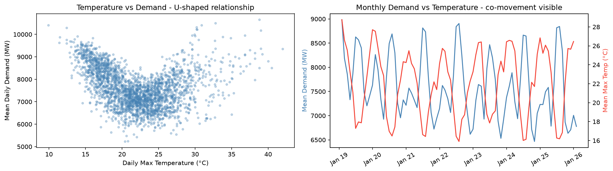
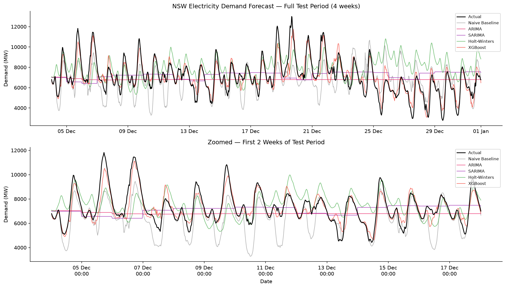
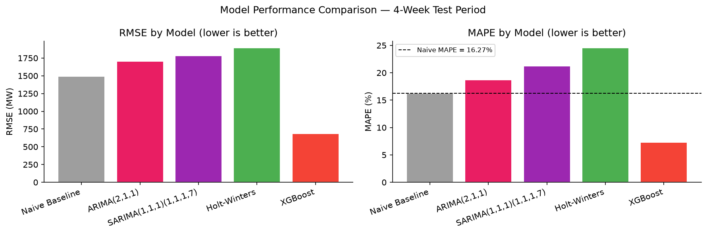
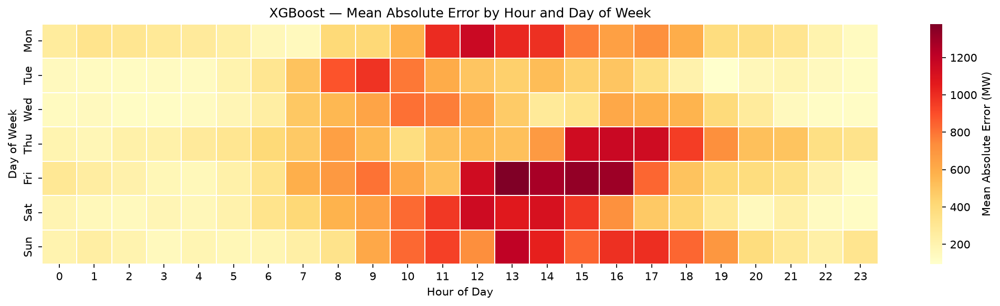
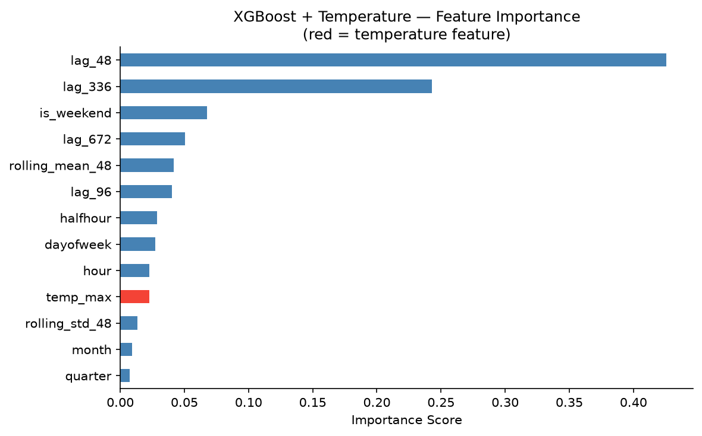

# NSW Electricity Demand Forecasting
*Viet Ngan Le | AEMO NSW1 | January 2019 - December 2025*

---

## Executive Summary

Electricity demand forecasting underpins generator scheduling, spot market bidding, and reserve capacity planning in the National Electricity Market. A 1,000 MW forecast error at peak demand - roughly the output of a large coal unit - can trigger emergency dispatch of fast-response peaking generation at multiples of the prevailing spot price, or leave a retailer exposed in the balancing market. Accuracy at the margins of peak demand has direct financial consequences.

This analysis evaluates six forecasting models against seven years of AEMO NSW1 half-hourly dispatch data (122,708 intervals, January 2019 to December 2025). The test set covers 4 December 2025 to 1 January 2026, a period chosen for its operational complexity: a December heat event, three Australian public holidays, and a summer demand ramp that naive historical models systematically underestimate.

XGBoost with lag features, calendar encoding, and daily maximum temperature achieves 6.8% MAPE - a 58.4% reduction against the naive seasonal baseline (16.3% MAPE). Temperature accounts for a further 7.4% relative reduction beyond history-and-calendar features alone. For a 4-week horizon using only publicly available inputs and no live weather feed, this result is competitive with published short-term benchmarks from more data-intensive pipelines.

Statistical time series models (ARIMA, SARIMA, Holt-Winters) are included as reference. At their native daily resolution, ARIMA achieves 12.3% daily MAPE and outperforms the naive baseline. Their weaker 30-minute scores are a granularity artefact rather than evidence of model failure.

---

## 1. Data

**Source:** AEMO Price and Demand - publicly available, no authentication required.

**Coverage:** NSW1 region, January 2019 to December 2025 (84 monthly CSV files, 122,708 rows after resampling).

**Key fields:**
- `TOTALDEMAND` - the aggregate electricity load on the NSW grid at each 30-minute settlement interval, measured in megawatts (MW). This is the quantity being forecast: the instantaneous load that generators must collectively supply to keep the grid in balance.
- `RRP` - regional reference price ($/MWh) - collected but not used in this analysis.

**Data engineering notes:**

AEMO introduced Five Minute Settlement in October 2021, switching dispatch intervals from 30 minutes to 5 minutes. Files from that point contain six times as many rows per month. All data was resampled to a consistent 30-minute mean frequency before analysis.

Australian Eastern Daylight Time creates two edge cases each year: a one-hour gap in October (spring-forward) and a duplicate hour in April (fall-back). The duplicate hour is dropped rather than attempting to resolve pre/post-transition ambiguity - approximately 54 rows are removed across seven years.

Demand ranges from 2,574 MW (overnight, low-load periods) to 13,723 MW (summer afternoon peaks). There is a visible structural break in 2020 corresponding to COVID-19 lockdowns - a step-down in commercial and industrial load that partially persisted through 2021.

**Temperature data:** Daily maximum, minimum, and mean temperatures for Sydney (Observatory Hill, -33.87°, 151.21°) were sourced from Open-Meteo's historical archive (ERA5 reanalysis). Temperature accuracy is within ~1-2°C of station observations.

---

## 2. Exploratory Data Analysis

### 2.1 Seasonal Patterns

NSW electricity demand is shaped by three overlapping cycles that any forecasting model needs to account for.

The **annual pattern** is unusual by global standards. Most electricity markets have a single winter peak driven by heating. NSW has two: a summer cooling peak from December to February driven by air conditioning, and a secondary winter heating peak in June to August. January and July are typically the highest-demand months. This dual-peak structure means that naive models anchored to the previous season's demand will perform differently depending on which part of the year the test window falls in.

**Weekly variation** is large and systematic. Weekday demand runs 15-20% above weekend levels as commercial and industrial loads - offices, factories, retail - effectively switch off on Saturdays and Sundays. Sunday demand is consistently lower than Saturday. This weekly rhythm is the strongest predictable structural signal in the data, and it is why recent history (yesterday, last week) forms the core of the XGBoost feature set.

**Intra-day variation** follows a classic dual-peak pattern: a morning ramp from around 6am peaking at 8-9am, a midday trough, then an evening peak between 6-8pm as residential loads come on (cooking, lighting, heating or cooling). Weekend peaks are flatter and shifted roughly an hour later than weekdays. The evening ramp is where models tend to accumulate the most error - the precise timing depends on behavioural factors that temperature and calendar features only partially capture.

### 2.2 Temperature-Demand Relationship

NSW demand shows a U-shaped relationship with temperature: elevated at both extremes. Below approximately 18°C, demand rises as heating loads increase. Above approximately 22°C, demand rises steeply as cooling loads dominate. The summer slope is steeper - air conditioning loads are larger and more spatially dispersed across the residential sector than gas-supplemented heating.

The monthly co-movement chart shows demand and temperature tracking closely during heatwaves (January, February) and cold periods (June, July). This co-movement is what makes temperature the single most important exogenous variable for NSW demand forecasting.

### 2.3 Stationarity

The Augmented Dickey-Fuller (ADF) test was applied to a representative 26-week sample. The test statistic of -4.70 (p-value = 0.00008) rejects the unit root null at the 1% level. In plain terms: demand does not drift indefinitely in one direction - it cycles predictably around a stable long-run mean, driven by the daily and weekly patterns described above. The 2020 structural break appears as a level shift but does not change the cyclical behaviour that statistical models rely on.

For ARIMA modelling, `d=1` (first differencing) was used to remove residual slow trends.

---

## 3. Methodology

### 3.1 Train-Test Split

The last four weeks of data (1,344 half-hour intervals, 4 December 2025 to 1 January 2026) were held out as the test set. All data prior to 4 December 2025 was used for training.

Time series observations are temporally dependent - each value is correlated with its recent history. Randomly assigning rows to train and test would expose future values during training, producing metrics that cannot be replicated in any real deployment. The held-out test set mirrors operational practice: forecasting strictly forward from a fixed training cutoff.

The test window spans the Christmas-New Year period, which contains three Australian public holidays. Demand on these days behaves like Sundays regardless of their calendar weekday position - a systematic pattern that none of the models capture, since no public holiday indicator was included in the feature set.

### 3.2 Evaluation Metrics

**RMSE (Root Mean Squared Error):** Expressed in MW. Penalises large errors more heavily than small ones - which matters for electricity, where a 2,000 MW peak-demand error is not simply "twice as costly" as a 1,000 MW error. Large forecast deviations can force emergency dispatch or leave generation unscheduled, both carrying costs that scale non-linearly with the error size.

**MAPE (Mean Absolute Percentage Error):** Scale-free. Used as the primary ranking metric because it is directly comparable across models, time windows, and grid sizes - a 6.8% MAPE on NSW demand communicates the same level of accuracy as 6.8% on Victorian demand, which RMSE in MW does not.

### 3.3 Evaluation Granularity

ARIMA and SARIMA were fit on daily-averaged data rather than 30-minute data. Fitting on the full 30-minute series covering seven years is computationally prohibitive. Their daily forecasts were forward-filled to 30-minute resolution for comparison at the same granularity as the other models.

A flat daily forecast evaluated against 30-minute data carries an inherent penalty: NSW demand has an intra-day standard deviation of approximately 1,264 MW against a daily mean of ~7,172 MW, a ~17.6% relative swing. Any model that cannot represent intra-day shape will accumulate this variance as forecast error regardless of daily-level accuracy.

Both 30-minute and daily metrics are reported so each model is assessed at the resolution it was designed for.

---

## 4. Models

### Seasonal Naive Baseline

For each test point, forecast the demand observed exactly four weeks prior. A four-week lag is used rather than one week because the test horizon is four weeks - a one-week lag would require using test-period observations to produce forecasts for weeks two through four.

Four weeks prior to December 2025 maps to early November 2025, a shoulder season with lower peak temperatures. The naive forecast therefore systematically under-predicts summer afternoon peaks in the test window, inflating naive MAPE for this particular period relative to what a year-on-year lag would produce.

### ARIMA(2,1,1)

Order (2,1,1) was selected from ACF/PACF analysis: the PACF cuts off after lag 2-3 (AR order 2), the ACF decays slowly after differencing (d=1), and a spike at lag 1 post-differencing suggests MA order 1. Fit on daily-averaged data, upsampled to 30-minute resolution.

### SARIMA(1,1,1)(1,1,1,7)

Extends ARIMA with a weekly seasonal component (m=7 for daily data), adding AR, differencing, and MA terms at the weekly frequency to capture the weekday/weekend pattern that plain ARIMA cannot represent. Fitting at 30-minute resolution with m=336 would be computationally prohibitive - state-space matrices scale as m×m. Fit on daily-averaged data, upsampled to 30-minute resolution.

### Holt-Winters Exponential Smoothing

Triple exponential smoothing with additive trend and additive seasonality at `seasonal_periods=336` (one full week of 30-minute intervals). Unlike ARIMA and SARIMA, Holt-Winters operates at full 30-minute resolution and explicitly represents intra-day shape.

Fixed smoothing parameters were used (level α=0.3, trend β=0.01, seasonal γ=0.05) rather than optimised values. The L-BFGS-B optimiser finds degenerate solutions near α≈β≈1 at weekly seasonal periods at 30-minute resolution, producing explosive long-horizon forecasts. The fixed parameters are standard starting points for short-horizon electricity demand forecasting and produce stable results.

### XGBoost with Lag Features

Gradient boosting treating demand forecasting as supervised regression. The time series structure is encoded as features rather than modelled explicitly.

**Feature set:**
- Lag features: demand at t-48 (24 hours prior), t-96 (48 hours), t-336 (one week), t-672 (two weeks)
- Rolling statistics: 48-period rolling mean and standard deviation
- Calendar features: hour of day, day of week, month, quarter, is-weekend flag, half-hour-of-day position

All lag and rolling features are computed with `.shift(k)` so that the feature for time t uses only observations at t-k and earlier - no leakage.

### XGBoost with Temperature

Extends the lag feature model with daily maximum temperature (`temp_max`) mapped to each 30-minute interval by date. Temperature is the dominant exogenous driver of demand variation in NSW - the U-shaped relationship means a single daily temperature figure captures the bulk of weather-driven demand variance that history-based features cannot anticipate.

---

## 5. Results

### 5.1 30-Minute Resolution

| Model | RMSE (MW) | MAPE (%) |
|-------|-----------|----------|
| **XGBoost + Temp** | **615.1** | **6.8%** |
| XGBoost | 684.0 | 7.3% |
| Naive Baseline | 1,492.1 | 16.3% |
| ARIMA(2,1,1) | 1,704.7 | 18.7% |
| SARIMA(1,1,1)(1,1,1,7) | 1,783.8 | 21.3% |
| Holt-Winters | 1,893.5 | 24.6% |

**What these numbers mean in practice:** NSW average weekday demand is approximately 7,200 MW. A 615 MW RMSE means the best model's typical error represents around 8.5% of average load - comparable to a single large open-cycle gas peaker unit cycling in or out. At daily granularity the error falls to 343 MW (Section 5.2), small enough to sit inside the operational reserve margin that grid operators maintain for unexpected demand swings. The model is accurate enough to materially improve day-ahead scheduling decisions, but not a substitute for the safety buffers that generators and network operators hold for extreme events.

### 5.2 Daily Resolution

| Model | RMSE daily (MW) | MAPE daily (%) |
|-------|-----------------|----------------|
| **XGBoost + Temp** | **343.5** | **4.0%** |
| XGBoost | 389.4 | 4.4% |
| ARIMA(2,1,1) | 1,090.0 | 12.3% |
| Naive Baseline | 1,164.7 | 14.4% |
| SARIMA(1,1,1)(1,1,1,7) | 1,213.4 | 14.2% |
| Holt-Winters | 1,641.2 | 20.1% |

At daily granularity ARIMA outperforms the naive baseline (12.3% vs 14.4%) - the result expected of a correctly specified daily model. SARIMA is slightly worse than naive here: the seasonal differencing in the (1,1,1,7) component appears to overfit to a weekday/weekend pattern that shifts during the Christmas test window. Holt-Winters performs poorly at both resolutions on this test set; its fixed seasonal component cannot adapt quickly to the atypical demand shape of the holiday period.

### 5.3 The Temperature Effect

The gap between XGBoost (7.3% MAPE) and XGBoost+Temp (6.8% MAPE) isolates what temperature adds beyond history and calendar features alone. On this December test set that is a 7.4% relative reduction - meaningful, but conservative compared to what a January heatwave window would produce, where air conditioning load swings are larger and more sustained. Adding temperature converts a history-extrapolation model into one that can anticipate demand spikes from incoming hot weather before they arrive.

---

## 6. Error Analysis

XGBoost+Temp mean absolute error by hour of day and day of week across the 4-week test set:

**Morning ramp (6-9am) and evening peak (6-8pm)** have the highest errors. These are the periods of fastest demand change. Even with temperature in the model, the precise timing and magnitude of ramps depend on behavioural factors - when people start cooking, run appliances, or leave work - that a single daily maximum temperature figure cannot fully represent.

**Weekend errors are elevated** relative to equivalent weekday hours. Weekend demand is more variable: leisure patterns, weather-dependent recreational loads, and fewer predictable commercial anchors make Saturdays and Sundays harder to forecast than weekdays.

**Overnight (2-4am) errors are near zero.** Overnight demand is stable and well-explained by lag features alone; temperature has minimal incremental effect at these hours.

**Christmas and Boxing Day (25-26 December)** appear as elevated error days regardless of hour. Both fall mid-week in 2025 but demand collapses to Sunday-equivalent levels. Without a public holiday indicator, the model predicts mid-week commercial demand and over-forecasts by 1,000-2,000 MW on these days.

---

## 7. Feature Importance

The 24-hour lag (t-48) is the dominant feature by a substantial margin, followed by the 1-week lag (t-336). This reflects the high short-term autocorrelation in demand: what happened at this exact time yesterday is a stronger predictor than what happened at this time last week. The weekly lag captures the day-of-week seasonal pattern, but recent history carries more predictive weight.

Calendar features - hour of day, day of week, is-weekend - contribute the structural intra-day and weekday/weekend shape. The rolling 24-hour mean captures recent demand level, which matters during heatwaves or cold snaps where the baseline level shifts over several consecutive days.

`temp_max` ranks within the top features, ahead of most calendar variables. Its importance is asymmetric: it contributes most on high-temperature days (above ~28°C) where air conditioning introduces demand that lag features cannot anticipate from history alone.

---

## 8. Limitations

All metrics are from a single four-week test window with specific characteristics: a December heat event and a public holiday cluster at Christmas-New Year. These features may produce MAPE estimates that do not represent average forecast difficulty across the full year. A robust evaluation would use rolling-window backtesting across multiple seasons to obtain stable performance estimates across cooling peaks, heating peaks, and shoulder-season periods.

The models produce point forecasts only. Operational energy forecasting requires probabilistic outputs - 10th, 50th, and 90th percentile bands - to support reserve capacity decisions and risk management. A grid operator scheduling reserve based on a point forecast has no principled basis for choosing how much buffer to hold; a prediction interval makes that a structured decision.

Public holidays are the most visible gap in the current feature set. Christmas Day and Boxing Day fall mid-week in 2025 but behave like Sundays. All models over-predict on these days by 1,000-2,000 MW. A binary `is_public_holiday` flag from the `holidays` Python package would address this directly and is the highest-return single change available.

Demand patterns in NSW have shifted structurally over the training period. Rooftop solar uptake has suppressed midday demand since around 2021; EV charging is beginning to appear as an evening load signature. The model captures these shifts implicitly through its training data, but the rate of change is accelerating. A live deployment would require periodic retraining to remain accurate.

Temperature is currently a single daily maximum figure. Sub-daily BOM temperature data (3-hourly or hourly) would better represent the timing of afternoon heat-driven demand peaks and overnight temperature effects on heating load. In a live forecasting context, ERA5 reanalysis data would also need to be replaced with a weather forecast product, since ERA5 requires historical actuals rather than future predictions.

---

## 9. Extensions

The highest-return single change is a public holiday calendar - one binary feature that would directly address the largest identifiable error in this test set. Christmas and Boxing Day over-prediction alone would meaningfully reduce December MAPE.

Sub-daily temperature would sharpen peak timing accuracy. Hourly BOM temperature forecasts better represent when afternoon heat load arrives rather than treating a 35°C day as uniformly hot across all 48 intervals. This change would also make the model deployable in a live context, since it would accept forecast weather rather than requiring observed historical actuals.

Probabilistic forecasting is a prerequisite for operational use. XGBoost Quantile Regression at the 10th, 50th, and 90th percentiles would provide the forecast distribution that reserve planning requires. Conformal prediction intervals offer an alternative with formal coverage guarantees.

Rolling backtesting across 12 or more held-out months would give stable, seasonally-stratified performance estimates - the difference between "6.8% MAPE on December 2025" and a confidence range across all seasons. The latter is what a decision-maker needs to calibrate how much to trust the forecast in any given month.

A simple ensemble of XGBoost+Temp and Holt-Winters is worth testing. Holt-Winters's explicit seasonal decomposition is complementary to XGBoost's flexibility on shorter-horizon variation; blended outputs often outperform either component alone for electricity demand.

Multi-region extension to VIC1 or full NEM-wide demand is a natural next step. NSW and Victoria have correlated load - similar climate exposure, overlapping commercial hours - but distinct characteristics. Victorian demand is more gas-heating dominated in winter; NSW cooling loads are larger in summer. A multi-region model would need to represent those differences explicitly.

---

## 10. Conclusions

The 58.4% MAPE reduction from naive to XGBoost+Temp is not a marginal improvement - it is the difference between a forecast that gives a trading desk genuine signal and one that cannot be trusted beyond "roughly what we saw four weeks ago."

Weather is the primary source of that gain. History and calendar features alone get the model to 7.3% MAPE; adding a single daily temperature figure takes it to 6.8%, isolating what weather information adds beyond what pure history can provide. On a hotter test window - a January heatwave rather than a mild December - that contribution would be larger.

The statistical models are not failures. ARIMA achieves 12.3% daily MAPE and outperforms the naive baseline at the resolution it was designed for. Their 30-minute scores are upsampling artefacts. For a retailer or network planner working at daily granularity, ARIMA provides interpretable, low-overhead forecasts that beat the naive alternative.

Two failure modes stand out. Public holidays produce systematic over-prediction of 1,000-2,000 MW - a fixable gap requiring one additional binary feature. Morning ramp and evening peak timing errors reflect the limits of a single daily temperature figure: temperature explains the demand level on a hot day but not the precise half-hour when loads switch on. Both are well-defined problems with well-defined solutions.

---

*Data: AEMO NSW1 Price and Demand - `https://aemo.com.au/aemo/data/nem/priceanddemand/`*
*Temperature: Open-Meteo historical archive (ERA5 reanalysis)*
*Period: January 2019 - December 2025*
*Code: `https://github.com/nancy-vn-le/electricity-demand-forecasting`*
