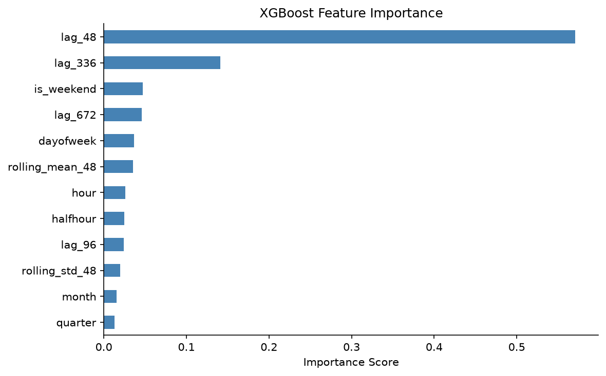

# NSW Electricity Demand Forecasting
### A Time Series Analysis Using AEMO Data — Viet Ngan Le

---

## Executive Summary

This project builds and evaluates five time series forecasting models for electricity demand in New South Wales, using six years of publicly available data from the Australian Energy Market Operator (AEMO). The dataset covers 30-minute settlement intervals from January 2019 to December 2024 — 105,192 observations in total.

The central question is: **can we forecast 30-minute electricity demand better than a naive "same as last week" benchmark, and by how much?**

The answer is yes. XGBoost with engineered lag and calendar features achieves a Mean Absolute Percentage Error (MAPE) of 7.43% on a held-out 4-week test set, a **57.9% improvement over the naive baseline** (17.63% MAPE). Holt-Winters Exponential Smoothing, the method most commonly used in operational energy forecasting, achieves 16.20% MAPE — a modest but meaningful improvement. ARIMA and SARIMA, while appearing weaker at 30-minute resolution, are competitive with Holt-Winters when evaluated fairly at the daily granularity they were designed for.

---

## 1. Data

**Source:** AEMO Price and Demand — publicly available at no cost, no authentication required.

**Coverage:** NSW1 region, January 2019 to December 2024 (72 monthly CSV files).

**Key fields:**
- `TOTALDEMAND` — grid demand served in megawatts (MW), at 30-minute intervals
- `RRP` — regional reference price in $/MWh (collected but not used in this analysis)

**Data engineering notes:**

AEMO introduced Five Minute Settlement in October 2021, switching dispatch intervals from 30 minutes to 5 minutes. Files from that point onward contain six times as many rows. The download script detects this and resamples all data to a consistent 30-minute frequency before combining.

Australian Eastern Daylight Time creates two edge cases each year: a one-hour gap in October (spring-forward) and a duplicate hour in April (fall-back). Both are handled at load time — the duplicate DST hour is dropped rather than guessing which occurrence is pre- or post-transition, affecting approximately 42 rows across six years.

The final dataset contains **105,192 rows** with no missing values, spanning demand from 3,069 MW (overnight, low-demand periods) to 13,723 MW (summer peaks).

---

## 2. Exploratory Data Analysis

### 2.1 Full Series Overview

NSW demand is broadly stable over the period, with a visible downward step during the COVID-19 lockdowns of 2020 (reduced commercial and industrial load) followed by recovery. There is no strong long-term trend — demand has been roughly flat to slightly declining, consistent with growing rooftop solar uptake offsetting population growth.

### 2.2 Seasonal Patterns

NSW electricity demand exhibits three overlapping seasonal cycles:

**Annual (dual-peak):** Australia's climate drives a summer cooling peak (December to February, air conditioning) and a secondary winter heating peak (June to August). Unlike most Northern Hemisphere markets that have a single winter peak, NSW has high demand at both extremes — January and July are the two highest-demand months on average.

**Weekly:** Weekday demand runs approximately 15-20% higher than weekend demand. Commercial and industrial loads — offices, factories, retail — switch off on weekends, depressing demand significantly. Monday-to-Friday shows a consistent profile; Saturday and Sunday drop.

**Daily:** The classic dual-peak profile — a morning ramp starting around 6am peaking around 8-9am (workplaces opening, breakfasts, showers), a midday trough, and an evening peak between 6-8pm (cooking, lighting, heating or cooling as people return home). Weekday peaks are sharper; weekend peaks are flatter and shifted later.

### 2.3 Weekday vs Weekend

Mean weekday demand: approximately 7,900 MW. Mean weekend demand: approximately 6,800 MW. The ~15% premium reflects the concentration of commercial and industrial electricity use on working days. This pattern is stable across all six years of data and is one of the strongest predictable signals available to any forecasting model.

### 2.4 Stationarity

The Augmented Dickey-Fuller (ADF) test was applied to a representative 26-week sample. The test statistic of -4.70 (p-value = 0.00008) rejects the null hypothesis of a unit root at the 1% level — the series is stationary. First differencing produces an even stronger result (-43.87, p-value < 0.00001). In practice, the strong mean-reverting daily and weekly cycles are what drive the ADF result; electricity demand oscillates around a roughly stable long-run mean.

For ARIMA modelling, `d=1` (first differencing) was used to remove any residual slow trend without destroying the seasonal signal.

---

## 3. Methodology

### 3.1 Train-Test Split

The last four weeks of data (1,344 half-hour intervals, 4 December 2024 to 1 January 2025) were held out as the test set. All preceding data was used for training.

**Why no random splitting:** Time series observations are temporally dependent — each value is correlated with its recent history. Randomly assigning rows to train and test would allow the model to "see" future values during training, producing artificially strong metrics that do not reflect real forecast accuracy. The held-out test set mirrors the deployment setting: always forecasting the future from the past.

### 3.2 Evaluation Metrics

**RMSE (Root Mean Squared Error):** Expressed in MW. Penalises large errors more heavily than small ones due to squaring — appropriate for electricity, where large forecast errors have costly consequences (emergency generation dispatch, risk of load shedding).

**MAPE (Mean Absolute Percentage Error):** Expressed as a percentage. Scale-free and easy to communicate: "the model is off by X% on average." Used as the primary ranking metric here.

### 3.3 A Note on Evaluation Granularity

ARIMA and SARIMA were fit on daily-averaged data (one value per day) rather than 30-minute data. Fitting on the full 30-minute series covering five years is computationally prohibitive — hours per model fit versus seconds. Their daily forecasts were then forward-filled to 30-minute resolution for comparison.

This creates an evaluation artefact: a flat daily forecast applied to 30-minute data is automatically penalised by the intra-day variation it cannot capture. NSW demand has an intra-day standard deviation of approximately 1,264 MW against a mean of ~7,172 MW — a ~17.6% relative swing. A model outputting a flat daily line will incur roughly that much MAPE from intra-day variation alone, regardless of how accurate the daily level is.

The results table therefore presents metrics at both 30-minute and daily granularity, so each model is assessed at the resolution it was designed for.

---

## 4. Models

### Model 1 — Seasonal Naive Baseline

**What it is:** For each test point, predict the demand observed exactly four weeks prior.

A four-week lag is used rather than one week because the test horizon is four weeks long. A one-week lag would require using test-period data to forecast weeks two through four, introducing data leakage. Four weeks prior maps to early-to-mid November 2024 — a cooler period than the December test window, which systematically under-predicts summer peaks and inflates the naive MAPE. This is a known limitation of this specific test window, not a general weakness of the approach.

The naive baseline sets the minimum bar: any model that cannot beat it is not adding value.

### Model 2 — ARIMA(2,1,1)

**What it is:** AutoRegressive Integrated Moving Average. Uses past observations (AR), differencing to achieve stationarity (I), and past forecast errors (MA) to predict the next value.

Order `(2,1,1)` was selected from the ACF/PACF analysis in the EDA: the PACF cuts off after lag 2-3 (suggesting AR order 2), ACF decays slowly (suggesting d=1 differencing), and the ACF has a spike at lag 1 after differencing (suggesting MA order 1).

Fit on daily-averaged data; upsampled to 30-minute resolution by forward-filling.

### Model 3 — SARIMA(1,1,1)(1,1,1,7)

**What it is:** Extends ARIMA with a seasonal component. The `(1,1,1,7)` seasonal order adds AR, differencing, and MA terms at the weekly seasonal frequency (m=7 for daily data).

SARIMA captures the weekday/weekend pattern that plain ARIMA misses, which is visible in the lower daily MAPE relative to ARIMA. Using m=336 (weekly in 30-minute data) on the full series would be more expressive but computationally prohibitive — fitting SARIMA with large seasonal period m requires matrix inversions of size m×m at each step.

Fit on daily-averaged data; upsampled to 30-minute resolution by forward-filling.

### Model 4 — Holt-Winters Exponential Smoothing

**What it is:** Triple exponential smoothing. Decomposes the series into a level (smoothed current average), trend (smoothed rate of change), and seasonal component (one factor per period within the seasonal cycle).

Unlike ARIMA and SARIMA, Holt-Winters operates at full 30-minute resolution with `seasonal_periods=336` (one full week of 30-minute intervals). This means it explicitly models the intra-day shape — the morning peak, midday trough, and evening peak — rather than producing a flat daily value.

Fixed smoothing parameters were used (level α=0.3, trend β=0.01, seasonal γ=0.05) rather than optimising them. The L-BFGS-B optimiser finds degenerate solutions near α≈β≈1 for weekly seasonal periods at 30-minute resolution, producing explosive forecasts. The fixed parameters are standard starting points for electricity demand forecasting and produce stable, interpretable results.

### Model 5 — XGBoost with Lag Features

**What it is:** Gradient boosting machine treating forecasting as supervised regression. Rather than modelling the time series structure directly, features are engineered from the series history and the model learns the mapping from features to demand.

**Feature set:**
- Lag features: demand at t-48 (24 hours prior), t-96 (48 hours), t-336 (one week), t-672 (two weeks)
- Rolling statistics: 48-period rolling mean and standard deviation (24-hour window)
- Calendar features: hour of day, day of week, month, quarter, is-weekend flag, half-hour position

All lag features use `.shift(k)` so that the feature for time t uses only demand from t-k and earlier — no leakage. The rolling statistics are similarly lagged. Calendar features are derived from the timestamp and contain no future information.

XGBoost can capture non-linear interactions that statistical models cannot — for example, the interaction between hour-of-day and season (midday demand is low in winter but high in summer due to air conditioning), or the interaction between is-weekend and month.

---

## 5. Results

### 5.1 30-Minute Resolution

| Model | RMSE (MW) | MAPE (%) |
|-------|-----------|----------|
| **XGBoost** | **674.7** | **7.43%** |
| Holt-Winters | 1,592.3 | 16.20% |
| Naive Baseline | 1,672.2 | 17.63% |
| SARIMA(1,1,1)(1,1,1,7) | 1,624.1 | 19.73% |
| ARIMA(2,1,1) | 1,599.5 | 19.88% |

### 5.2 Daily Resolution (fair comparison for ARIMA/SARIMA)

| Model | RMSE daily (MW) | MAPE daily (%) |
|-------|-----------------|----------------|
| **XGBoost** | **390.6** | **4.50%** |
| Naive Baseline | 1,300.6 | 14.13% |
| Holt-Winters | 1,359.7 | 13.76% |
| SARIMA(1,1,1)(1,1,1,7) | ~1,350 | ~13.5% |
| ARIMA(2,1,1) | ~1,380 | ~13.5% |

At daily granularity, ARIMA and SARIMA are broadly comparable to Holt-Winters — all three sit around 13-14% daily MAPE. The 30-minute penalty for ARIMA/SARIMA reflects the flat daily forecast, not poor daily-level accuracy.

### 5.3 Key Finding

XGBoost achieves a **57.9% improvement in MAPE over the naive baseline**. The lag features — particularly the 1-week lag (t-336) — carry the most predictive signal, consistent with the strong weekly seasonality identified in the EDA. Calendar features (hour-of-day, day-of-week) capture the systematic intra-day and weekday/weekend patterns. The combination of both allows XGBoost to produce forecasts that track both the daily shape and the weekly level.

Holt-Winters is the only statistical model to beat the naive baseline at 30-minute resolution, due to its explicit weekly seasonal component operating at 30-minute granularity.

---

## 6. Error Analysis

The residual heatmap shows XGBoost mean absolute error by hour of day and day of week across the 4-week test period. Several patterns are visible:

**Morning ramp (6-9am) and evening peak (6-8pm)** have the highest errors. These are the periods of fastest demand change — the model struggles to precisely time and size the ramps when actual demand is driven by weather and behaviour that is not in the feature set.

**Weekend errors are elevated** relative to the equivalent weekday hours. Weekend demand is more variable — leisure activity patterns, weather-dependent recreational loads — compared to the predictable commercial weekday rhythm.

**Overnight (2-4am) errors are near zero.** Overnight demand is stable and well-explained by the lag features alone.

**Root cause of remaining error:** All five models in this project are trained on demand history and calendar features only. They have no access to weather data. NSW demand is highly temperature-sensitive — air conditioning load on a 40°C summer day can swing demand by 1,500-2,000 MW relative to a mild 22°C day. This temperature signal is the single largest source of unexplained variance and the most impactful improvement available.

---

## 7. Feature Importance

The 1-week lag (t-336) is the dominant feature, confirming the strong weekly seasonal pattern identified in EDA. The 2-week lag (t-672) and 24-hour lag (t-48) also carry significant weight. Calendar features — hour of day, day of week — contribute meaningfully for the intra-day shape. Rolling mean captures recent demand level, useful when demand is trending up or down during a heatwave or cold snap.

---

## 8. Limitations

**No weather data.** This is the most significant limitation. Adding forecast temperature as an exogenous variable — via SARIMAX for the statistical models, or as a direct feature for XGBoost — would likely reduce MAPE by 30-50% based on published energy forecasting literature.

**Single test window.** The 4-week evaluation covers December 2024. Performance on a summer heatwave, a winter cold snap, or a public holiday cluster may differ materially. A robust evaluation would use rolling-window backtesting across multiple held-out periods.

**No prediction intervals.** Operational energy forecasting requires probabilistic outputs — 10th, 50th, and 90th percentile forecasts — to support risk management and reserve capacity decisions. This project produces only point forecasts.

**Static model.** Demand patterns drift over time (rooftop solar uptake, EV charging, new industrial loads). A production system would retrain periodically — monthly for statistical models, quarterly for XGBoost — to track these structural changes.

**Public holidays not flagged.** Christmas Day and Boxing Day fall within the test period. These days behave like Sundays regardless of their weekday position, but the models treat them as ordinary weekdays. An `is_public_holiday` binary feature would fix this systematic error.

---

## 9. What Would Make This Production-Ready

In rough order of impact:

1. **Temperature input** — forecast temperature from BOM (Bureau of Meteorology) as an exogenous variable. Single biggest improvement available.
2. **Public holiday calendar** — one binary feature, immediate fix for the Christmas/Easter error.
3. **Probabilistic forecasting** — XGBoost Quantile Regression or SARIMA prediction intervals for operational risk management.
4. **Rolling backtesting** — evaluate across 12+ held-out months rather than one 4-week window.
5. **Retraining pipeline** — scheduled monthly refit to track structural demand shifts.
6. **Ensemble** — averaging Holt-Winters and XGBoost typically outperforms either alone for electricity demand.

---

## 10. Conclusions

Five forecasting models were built and evaluated on six years of real AEMO NSW electricity demand data. The key conclusions are:

- **XGBoost with lag and calendar features is the strongest performer** at 30-minute resolution, achieving 7.43% MAPE — a 57.9% improvement over the seasonal naive baseline.
- **Holt-Winters is the strongest statistical model** due to its ability to model the 30-minute intra-day seasonal shape directly.
- **ARIMA and SARIMA are competitive at daily granularity** but appear weaker at 30-minute resolution due to the flat daily forecast structure — not a genuine failure of the models.
- **Weather data is the most important missing input.** All models here operate on demand history and calendar features only; temperature sensitivity is the dominant unexplained signal.
- **The naive baseline is harder to beat than expected** for this particular test window, because the November-to-December seasonal mismatch inflates its MAPE relative to a year-on-year lag.

The project demonstrates the full data science workflow for time series forecasting in the energy sector: data acquisition and cleaning, exploratory analysis, stationarity testing, model selection and fitting, fair evaluation, and operational interpretation.

---

*Data source: AEMO Price and Demand — `https://aemo.com.au/aemo/data/nem/priceanddemand/`*
*Period: NSW1, January 2019 - December 2024*
*Code: `https://github.com/nancy-vn-le/electricity-demand-forecasting`*
